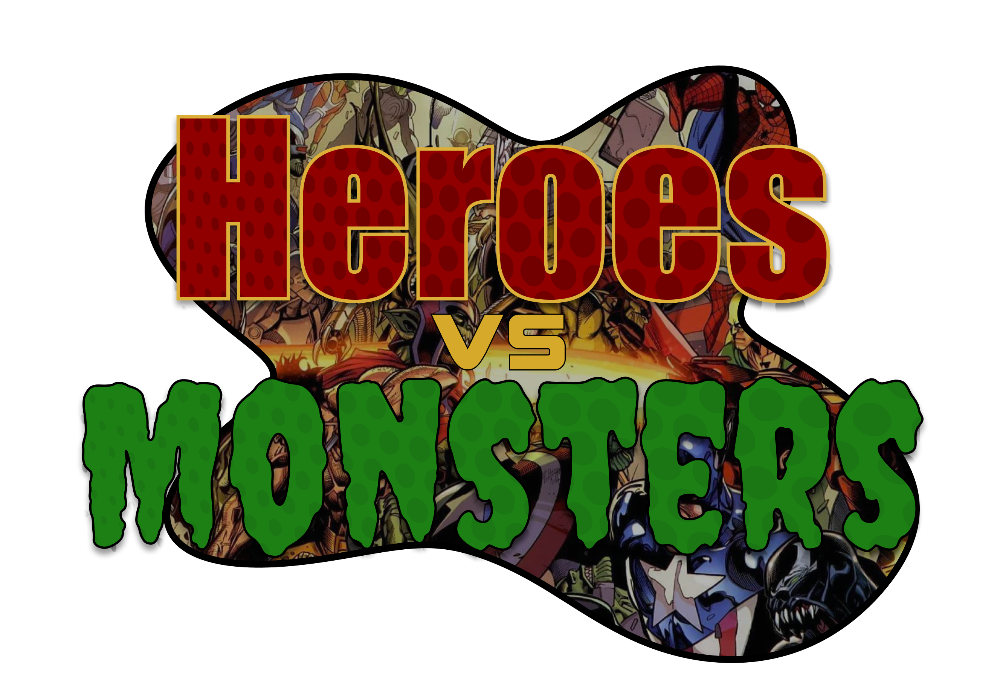

# Heroes vs Monsters

Heroes vs Monsters is a 2D game inspired by Plants vs Zombies, built with LibGDX. In this game, players place characters in different lanes to defend against incoming enemies. The game features a simple and clean interface, with intuitive controls and engaging gameplay.

## Features

- 6 horizontal lanes for strategic character placement
- Left pane with 5 different characters, each having a unique icon and cost
- Right pane with counters for in-game resources and a menu button
- Clear and minimalistic user interface with visually appealing graphics based on Marvel characters
- 8-bit music based on Marvel theme song, and similar tracks.

## Installation

1. Download the latest version of Android Studio from https://developer.android.com/studio
2. In Android Studio, create a new project from version control, by pressing New -> Project from Version Control.
3. When prompted, clone the project from this repository via HTTPS or SSH at your own discretion.
4. After opening, Android Studio should automatically detect the project as a Gradle project and sync it.
4. Run the game on your desktop, Android device, or emulator.

## Controls
- Tap on a character icon in the left pane to select it.
- Tap on an empty lane in the middle pane to place the selected character.
- Monitor your resources in the right pane.
- Access the menu by tapping the menu button in the right pane.

## Dependencies
- [LibGDX](https://libgdx.badlogicgames.com/) - Game development framework
- [FireBase Interface](https://firebase.google.com/) - Backend for data storage and real-time updates
- Ashely ECS

